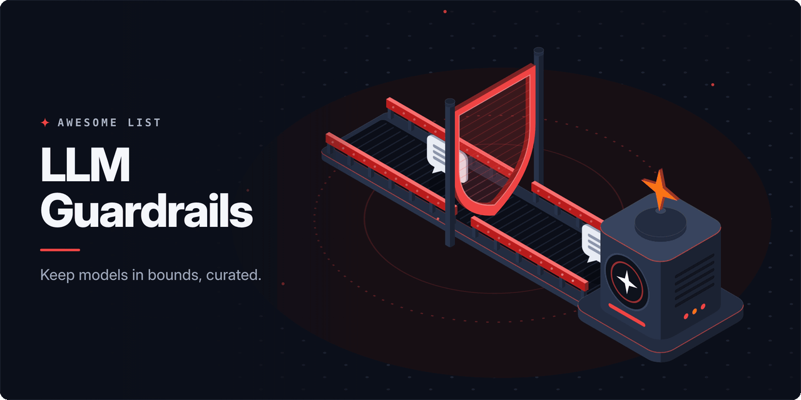

<!-- awesome:hero --><!-- /awesome:hero -->

<!-- awesome:title --><h1 align="center">Awesome LLM Guardrails</h1><!-- /awesome:title -->

<!-- awesome:tagline -->Guardrail frameworks, prompt injection and jailbreak detectors, PII filters, safety classifiers and red-teaming tools for LLM apps.<!-- /awesome:tagline -->

<!-- awesome:badges -->

  
  
  

<!-- /awesome:badges -->

Guardrails are the checks that sit around a language model, screening what goes in, what comes out and what an agent is about to do. This list covers the open-source frameworks, detectors, guard models, hosted services, red-teaming tools and references for keeping LLM apps safe and in policy.

## Contents

- [Guardrail frameworks](#guardrail-frameworks)
- [Prompt injection and jailbreak defense](#prompt-injection-and-jailbreak-defense)
- [Safety classifiers and guard models](#safety-classifiers-and-guard-models)
- [PII and data protection](#pii-and-data-protection)
- [Agent and tool-call guardrails](#agent-and-tool-call-guardrails)
- [Guardrails in frameworks and gateways](#guardrails-in-frameworks-and-gateways)
- [Hosted guardrail services](#hosted-guardrail-services)
- [Red teaming and scanners](#red-teaming-and-scanners)
- [Benchmarks and datasets](#benchmarks-and-datasets)
- [Guides and standards](#guides-and-standards)
- [Contributing](#contributing)

## Guardrail frameworks

- [Arthur Engine](https://github.com/arthur-ai/arthur-engine) - Self-hosted service that checks LLM traffic for PII, toxicity, injection and hallucination.
- [FMS Guardrails Orchestrator](https://github.com/foundation-model-stack/fms-guardrails-orchestrator) - Server that runs detectors on model inputs and outputs; the core of TrustyAI Guardrails.
- [Guardrails AI](https://github.com/guardrails-ai/guardrails) - Python framework that runs validators on LLM inputs and outputs and fixes or rejects failures.
- [Guardrails Hub](https://guardrailsai.com/hub) - Catalog of ready-made validators for Guardrails AI, from PII and toxicity to topic checks.
- [hai-guardrails](https://github.com/presidio-oss/hai-guardrails) - TypeScript library of guards for injection, leakage, PII, secrets and toxic content.
- [NeMo Guardrails](https://github.com/NVIDIA-NeMo/Guardrails) - NVIDIA toolkit for programmable input, output, dialog and retrieval rails written in Colang.
- [OpenAI Guardrails (JavaScript)](https://github.com/openai/openai-guardrails-js) - TypeScript version of OpenAI's guardrails library, wrapping the client with configured checks.
- [OpenAI Guardrails (Python)](https://github.com/openai/openai-guardrails-python) - Drop-in OpenAI client wrapper that runs configured checks on prompts, outputs and tool calls.
- [OpenGuardrails](https://github.com/openguardrails/openguardrails) - Vendor-neutral spec for plugging guardrail detectors into agents, with a shared benchmark.
- [Superagent](https://github.com/superagent-ai/superagent) - SDK that blocks prompt injection, redacts PII and secrets, and runs red-team scenarios.

## Prompt injection and jailbreak defense

- [Agent Threat Rules](https://github.com/Agent-Threat-Rule/agent-threat-rules) - Sigma-style YAML detection rules for prompt injection, tool poisoning and other agent threats.
- [Lasso Claude Code hooks](https://github.com/lasso-security/claude-hooks) - Claude Code hooks that scan tool output for indirect prompt injection before the model acts.
- [Llama Prompt Guard 2](https://github.com/meta-llama/PurpleLlama/tree/main/Llama-Prompt-Guard-2) - Meta's small classifiers that flag prompt injection and jailbreak attempts.
- [Meta SecAlign](https://github.com/facebookresearch/Meta_SecAlign) - Llama models trained to ignore instructions that arrive inside data.
- [NemoGuard JailbreakDetect](https://huggingface.co/nvidia/NemoGuard-JailbreakDetect) - NVIDIA classifier that flags jailbreak attempts, made to plug into NeMo Guardrails.
- [PIGuard](https://github.com/leolee99/PIGuard) - Prompt injection guard model trained to cut false alarms on harmless inputs.
- [Prompt Guard](https://github.com/seojoonkim/prompt-guard) - Multilingual prompt injection detector for AI agents, with severity scores.
- [PROMPTPurify](https://github.com/securelayer7/PROMPTPurify) - Compact model that classifies prompts as injection attempts without regex or signatures.
- [SecAlign](https://github.com/facebookresearch/SecAlign) - Preference-optimization method that trains models to resist prompt injection.
- [StruQ](https://github.com/Sizhe-Chen/StruQ) - Defense that splits prompt and data into separate channels with structured queries.

## Safety classifiers and guard models

- [Detoxify](https://github.com/unitaryai/detoxify) - Models that score text for toxicity, threats, insults and identity attacks.
- [GLiGuard](https://github.com/fastino-ai/GLiGuard) - Small encoder guard model that scores several moderation tasks in a single pass.
- [gpt-oss-safeguard](https://github.com/openai/gpt-oss-safeguard) - Open-weight OpenAI reasoning models that classify content against a policy you write.
- [Granite Guardian](https://github.com/ibm-granite/granite-guardian) - IBM models that flag harm, jailbreaks, hallucination and RAG risks in prompts and replies.
- [Kanana Safeguard](https://huggingface.co/kakaocorp/kanana-safeguard-8b) - Kakao's Korean-language model that flags harmful user prompts and assistant replies.
- [Llama Guard 4](https://github.com/meta-llama/PurpleLlama/tree/main/Llama-Guard4) - Meta's multimodal classifier that labels prompts and replies against a hazard taxonomy.
- [Nemotron Safety Guard](https://huggingface.co/nvidia/Llama-3.1-Nemotron-Safety-Guard-8B-v3) - NVIDIA multilingual model that labels prompts and responses safe or unsafe by category.
- [Qwen3Guard](https://github.com/QwenLM/Qwen3Guard) - Alibaba's multilingual guard models, with a streaming variant that checks tokens as they arrive.
- [RobloxGuard](https://github.com/Roblox/RobloxGuard-1.0) - Roblox model that checks prompts and responses against its safety policy.
- [ShieldGemma](https://ai.google.dev/gemma/docs/shieldgemma) - Google's Gemma-based classifiers for harmful text and, in ShieldGemma 2, images.

## PII and data protection

- [DataFog](https://github.com/DataFog/datafog-python) - Local PII detection and redaction for LLM apps, with a LiteLLM guardrail and Claude Code hook.
- [DontFeedTheAI](https://github.com/zeroc00I/DontFeedTheAI) - Proxy that strips IPs, credentials, hostnames and PII from pentest data before an LLM sees it.
- [Kiji Privacy Proxy](https://github.com/dataiku/kiji-proxy) - Dataiku proxy that masks PII in requests to AI APIs with realistic dummy values.
- [OneAIFW](https://github.com/funstory-ai/aifw) - Local AI firewall that anonymizes sensitive data before an LLM call and restores it after.
- [OpenAI Privacy Filter](https://github.com/openai/privacy-filter) - Small open-weight model that finds and masks PII in long text.
- [Presidio](https://github.com/data-privacy-stack/presidio) - Framework, started at Microsoft, that detects and anonymizes PII in text and images.
- [Privacy Filter (Go)](https://github.com/packyme/privacy-filter) - Go library and gateway that strips PII and secrets from text before it reaches an LLM.
- [Rehydra](https://github.com/rehydra-ai/rehydra-sdk) - SDK that swaps PII for stable placeholders in prompts and restores it in replies.
- [Rizzo PII](https://github.com/Rizzo-AI-Academy/rizzo-pii) - Local tool that anonymizes documents before you share them with an LLM.
- [Skyflow for GenAI](https://www.skyflow.com/product/skyflow-for-genai) - Data privacy vault that de-identifies sensitive data before it reaches an LLM.
- [Tonic Textual](https://www.tonic.ai/products/textual) - Service that redacts or synthesizes sensitive entities in text used for training and RAG.

## Agent and tool-call guardrails

- [Adrian](https://github.com/secureagentics/Adrian) - Runtime monitor that reads agent actions and reasoning to block malicious or out-of-scope steps.
- [Agent Control](https://github.com/agentcontrol/agent-control) - Central control layer that checks agent inputs and outputs against shared rules.
- [Agent Governance Toolkit](https://github.com/microsoft/agent-governance-toolkit) - Microsoft toolkit for policy enforcement, identity and sandboxing around AI agents.
- [cc-safety-net](https://github.com/kenryu42/cc-safety-net) - Pre-execution hook that blocks destructive git and file commands from coding agents.
- [Destructive Command Guard](https://github.com/Dicklesworthstone/destructive_command_guard) - Hook that stops coding agents from running dangerous git and shell commands.
- [Failproof AI](https://github.com/FailproofAI/failproofai) - Hooks into coding agent harnesses to record runs and block risky tool calls by policy.
- [Invariant Guardrails](https://github.com/invariantlabs-ai/invariant) - Rule language that checks agent traces and tool calls for unsafe data flows.
- [LlamaFirewall](https://github.com/meta-llama/PurpleLlama/tree/main/LlamaFirewall) - Meta framework that scans agent inputs, reasoning and generated code for attacks.
- [OpenAPPA](https://github.com/archestra-ai/OpenAPPA) - Checks each agent action against a policy on whether data may flow to its destination.
- [Pipelock](https://github.com/luckyPipewrench/pipelock) - Agent firewall that scans HTTP, MCP and WebSocket traffic for exfiltration and injection.
- [Prismor](https://github.com/PrismorSec/prismor) - Self-hosted control plane that watches, holds for approval or blocks agent tool calls.
- [Sponsio](https://github.com/SponsioLabs/Sponsio) - Checks agent tool calls against stateful rules before they run.

## Guardrails in frameworks and gateways

- [Bifrost guardrails](https://docs.getbifrost.ai/enterprise/guardrails) - Bifrost gateway feature that runs regex, secret, PII and partner checks on traffic.
- [Cloudflare AI Gateway guardrails](https://developers.cloudflare.com/ai-gateway/features/guardrails/) - Checks prompts and responses in Cloudflare AI Gateway for harmful content.
- [Kong AI Prompt Guard](https://developer.konghq.com/plugins/ai-prompt-guard/) - Kong plugin that allows or denies prompts by regex patterns.
- [LangChain guardrails](https://docs.langchain.com/oss/python/langchain/guardrails) - LangChain agent middleware for PII redaction, human approval and custom checks.
- [LiteLLM guardrails](https://docs.litellm.ai/docs/proxy/guardrails/quick_start) - LiteLLM proxy feature that runs guardrail providers before and after model calls.
- [Mastra guardrails](https://mastra.ai/docs/agents/guardrails) - Mastra input and output processors for injection, PII and moderation checks.
- [OpenAI Agents SDK guardrails](https://openai.github.io/openai-agents-python/guardrails/) - Input, output and tool guardrails that run alongside agents in the OpenAI Agents SDK.
- [Plano guardrails](https://docs.planoai.dev/guides/prompt_guard.html) - Plano proxy filters that apply safety checks to prompts before they reach agents.
- [Portkey guardrails](https://portkey.ai/docs/product/guardrails) - Portkey gateway checks on inputs and outputs, with partner guardrail providers.

## Hosted guardrail services

- [Akamai Firewall for AI](https://www.akamai.com/products/firewall-for-ai) - Edge service that filters prompts and responses for injection, leaks and toxic content.
- [Amazon Bedrock Guardrails](https://aws.amazon.com/bedrock/guardrails/) - AWS service with content filters, denied topics, PII redaction and grounding checks.
- [Azure AI Content Safety](https://learn.microsoft.com/en-us/azure/ai-services/content-safety/overview) - Azure API that detects harmful text and images in prompts and model output.
- [Azure Prompt Shields](https://learn.microsoft.com/en-us/azure/ai-services/content-safety/concepts/jailbreak-detection) - Azure API that detects direct and document-borne prompt injection.
- [Cisco AI Defense](https://www.cisco.com/site/us/en/products/security/ai-defense/index.html) - Cisco service that validates models and enforces runtime guardrails on AI apps.
- [Cloudflare Firewall for AI](https://developers.cloudflare.com/waf/detections/firewall-for-ai/) - Cloudflare WAF feature that flags PII, unsafe topics and injection in prompts.
- [CrowdStrike Falcon AIDR](https://www.crowdstrike.com/en-us/platform/falcon-guardian-aidr/) - CrowdStrike runtime protection for prompts and responses, formerly Pangea AI Guard.
- [Enkrypt AI](https://www.enkryptai.com) - Platform for guardrails, red teaming and monitoring of AI apps and agents.
- [Fiddler Guardrails](https://www.fiddler.ai/guardrails) - Low-latency checks that block jailbreaks, hallucinations and unsafe outputs.
- [Google Model Armor](https://cloud.google.com/security/products/model-armor) - Google Cloud service that screens prompts and responses for injection, leaks and harm.
- [HiddenLayer](https://www.hiddenlayer.com) - AI security platform with runtime detection and response for model and agent traffic.
- [Lakera Guard](https://www.lakera.ai/lakera-guard) - API that screens prompts and responses for injection, data leaks and policy breaks.
- [Lasso Security](https://www.lasso.security) - Platform that monitors and guards employee and app use of LLMs and agents.
- [Mistral moderation](https://docs.mistral.ai/studio/conversations/moderation) - Mistral API that classifies text and conversations across harm categories.
- [OpenAI Moderation](https://developers.openai.com/api/docs/guides/moderation) - Free OpenAI endpoint that flags harmful text and images by category.
- [Perspective API](https://perspectiveapi.com) - Jigsaw API that scores text for toxicity and related attributes.
- [Prisma AIRS](https://www.paloaltonetworks.com/ai-security/prisma-airs) - Palo Alto Networks platform for runtime protection, model scanning and red teaming.
- [Prompt Security](https://prompt.security) - Platform that inspects prompts and responses across employee AI tools and homegrown apps.
- [Straiker](https://www.straiker.ai) - Service that detects prompt injection, tool misuse and runtime attacks on AI agents.

## Red teaming and scanners

- [Agent OPFOR](https://github.com/KeyValueSoftwareSystems/agent-opfor) - Adversary emulation for AI agents and MCP servers from the CLI, IDE or browser.
- [Agentic Security](https://github.com/msoedov/agentic_security) - Vulnerability scanner that fuzzes LLM endpoints with jailbreak and injection datasets.
- [AI-Infra-Guard](https://github.com/Tencent/AI-Infra-Guard) - Tencent red-teaming platform for agents, MCP servers, skills and LLM jailbreaks.
- [Augustus](https://github.com/praetorian-inc/augustus) - Go binary from Praetorian that probes LLMs for injection, jailbreaks and adversarial input.
- [CyberSecEval](https://github.com/meta-llama/PurpleLlama/tree/main/CybersecurityBenchmarks) - Meta's benchmarks for injection resistance and cyber risk in model output.
- [DeepTeam](https://github.com/confident-ai/deepteam) - Framework that red-teams LLMs and agents against a catalog of vulnerabilities.
- [EasyJailbreak](https://github.com/EasyJailbreak/EasyJailbreak) - Python framework that builds and runs jailbreak attacks from published recipes.
- [FuzzyAI](https://github.com/cyberark/FuzzyAI) - CyberArk fuzzer that searches for jailbreaks in LLM APIs.
- [garak](https://github.com/NVIDIA/garak) - NVIDIA scanner that probes models for jailbreaks, injection, leakage and toxic output.
- [Giskard](https://github.com/Giskard-AI/giskard-oss) - Testing library that scans LLM agents for safety and quality issues.
- [Gray Swan](https://www.grayswan.ai) - Red-teaming arena and security products for finding and blocking AI attacks.
- [Lakera Red](https://www.lakera.ai/ai-red-teaming) - Lakera's red-teaming service for GenAI apps and agents.
- [LLAMATOR](https://github.com/LLAMATOR-Core/llamator) - Python framework for red-teaming chatbots and GenAI systems.
- [LLMMap](https://github.com/Hellsender01/LLMMap) - Finds injection points in HTTP requests to LLM apps and fires generated attack prompts.
- [Mindgard](https://mindgard.ai) - Automated red teaming and attack detection for AI models and agents.
- [Moonshot](https://github.com/aiverify-foundation/moonshot) - AI Verify tool that benchmarks and red-teams LLM applications.
- [Prompt Fuzzer](https://github.com/prompt-security/ps-fuzz) - Interactive tool that attacks your system prompt to test how well it holds.
- [promptfoo](https://github.com/promptfoo/promptfoo) - CLI for prompt tests and red-team scans of LLM apps, agents and RAG.
- [promptmap](https://github.com/utkusen/promptmap) - Scanner that runs prompt injection attacks against your own LLM app.
- [PyRIT](https://github.com/microsoft/PyRIT) - Microsoft framework for automated, multi-turn red teaming of generative AI.
- [Spikee](https://github.com/ReversecLabs/spikee) - Kit for building prompt injection datasets and testing apps against them.
- [ZeroLeaks](https://github.com/ZeroLeaks/zeroleaks) - Scanner that tests AI systems for prompt injection and system prompt extraction.

## Benchmarks and datasets

- [Aegis 2.0](https://huggingface.co/datasets/nvidia/Aegis-AI-Content-Safety-Dataset-2.0) - NVIDIA dataset of human-labeled prompts and replies for training content safety models.
- [AgentDojo](https://github.com/ethz-spylab/agentdojo) - Environment for measuring prompt injection attacks and defenses on tool-using agents.
- [AgentHarm](https://huggingface.co/datasets/ai-safety-institute/AgentHarm) - UK AI Security Institute benchmark of harmful multi-step agent tasks.
- [CircleGuardBench](https://github.com/whitecircle/circle-guard-bench) - Benchmark of how well guard models block harm, resist jailbreaks and avoid false positives.
- [Open Prompt Injection](https://github.com/liu00222/Open-Prompt-Injection) - Benchmark and toolkit for prompt injection attacks and defenses.
- [ToxicChat](https://huggingface.co/datasets/lmsys/toxic-chat) - Real user prompts from a chatbot demo, labeled for toxicity and jailbreaking.
- [WildJailbreak](https://huggingface.co/datasets/allenai/wildjailbreak) - Allen AI dataset of harmful and benign prompts in plain and adversarial forms.

## Guides and standards

- [Arcanum Prompt Injection Taxonomy](https://github.com/Arcanum-Sec/arc_pi_taxonomy) - Taxonomy of prompt injection intents, techniques and evasions.
- [Constitutional Classifiers](https://www.anthropic.com/news/constitutional-classifiers) - Anthropic's write-up of classifiers trained from a constitution to stop jailbreaks.
- [Design Patterns for Securing LLM Agents against Prompt Injections](https://arxiv.org/abs/2506.08837) - Paper on agent designs that limit what injected text can do.
- [Gandalf](https://gandalf.lakera.ai) - Lakera's game for practicing prompt injection against stronger and stronger defenses.
- [Llama Guard paper](https://arxiv.org/abs/2312.06674) - The paper that introduced Llama Guard and the LLM-as-classifier guard model.
- [Llama Protections](https://dev.meta.ai/llama/llama-protections) - Meta's guide to Llama Guard, Prompt Guard, LlamaFirewall and related tools.
- [Microsoft AI Red Teaming Playground Labs](https://github.com/microsoft/AI-Red-Teaming-Playground-Labs) - Hands-on labs from Microsoft's AI red-teaming training.
- [Mitigate jailbreaks and prompt injections](https://platform.claude.com/docs/en/test-and-evaluate/strengthen-guardrails/mitigate-jailbreaks) - Anthropic's guide to screening inputs and hardening prompts.
- [MITRE ATLAS](https://atlas.mitre.org) - Knowledge base of adversary tactics and techniques against AI systems.
- [NIST AI 600-1](https://www.nist.gov/publications/artificial-intelligence-risk-management-framework-generative-artificial-intelligence) - NIST's generative AI profile of the AI Risk Management Framework.
- [OpenAI Cookbook: How to implement LLM guardrails](https://cookbook.openai.com/examples/how_to_use_guardrails) - Notebook on building input and output guardrails.
- [OWASP Top 10 for Agentic Applications](https://genai.owasp.org/resource/owasp-top-10-for-agentic-applications-for-2026/) - OWASP's ranked list of security risks in agentic AI systems.
- [OWASP Top 10 for LLM Applications](https://genai.owasp.org/llm-top-10/) - OWASP's ranked list of security risks in LLM apps, prompt injection first.
- [Prompt injection series](https://simonwillison.net/series/prompt-injection/) - Simon Willison's running series on prompt injection attacks and defenses.
- [Secure AI Framework](https://saif.google) - Google's framework and risk map for securing AI systems.
- [Spotlighting](https://arxiv.org/abs/2403.14720) - Microsoft paper on marking untrusted input so models can tell it from instructions.
- [Tensor Trust](https://tensortrust.ai) - Online game of prompt injection attacks and defenses whose data became a benchmark.
- [The lethal trifecta](https://simonwillison.net/2025/Jun/16/the-lethal-trifecta/) - Essay on why private data, untrusted content and outbound access together are unsafe.

## Contributing

Contributions are welcome. Read the [contribution guidelines](contributing.md) first.

<!-- awesome:maintainer -->
Maintained by [Ian Wiedenman](https://github.com/ianwieds).
<!-- /awesome:maintainer -->
